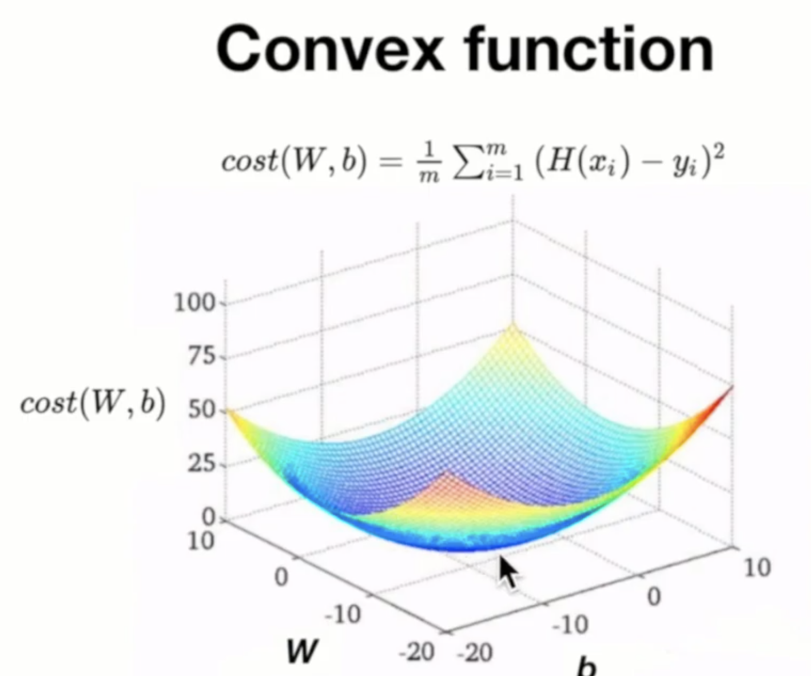

DLZeroToAll lecture 3

## Simplified hypothesis

원래 hypothesis와 cost에서 W(weight,기울기)만 남고 b(bias)만 생략되었다.

> Hypothesis : H(x) = Wx
Cost : 오차 제곱의 평균

## W값이 바뀔 때 cost값의 변화

Data set (x,y) = (1,1), (2,2), (3,3)일 때
w값이 1을 기준으로 완만한 2차함수 형태를 그리게된다.

우리의 목적은 cost가 최소화되는 W값을 찾는것이므로, 코스트를 최소화하는 W값은 1임을 알 수 있다. 그래프를 그려 확인하면 직관적으로 알 수 있지만, 컴퓨터를 이용해 찾기위해서는 알고리즘을 이용해 기계적으로 해당 W값을 찾도록 계산시켜야한다.

이러한 과정을 구현한 알고리즘이 Gradient descent algorithm이다.

# Gradient descent algorithm 경사하강법, 경사하강 알고리즘

경사를 따라 내려가면서 최저점을 찾도록 설계된 알고리즘.

알고리즘 문제의 대부분은 최적화 문제이고, 이득을 최대화하거나 손실을 최소화시키는데에 목적이 있다. 손실, 즉 cost를 최소화하는 알고리즘 중 하나가 *Gradient descent algorithm*이다.

이 알고리즘은 변수(W)가 여러개(W1,W2…)일 때도 사용할 수 있다.

## 적용방법

- initial guesses (W,b)에서 시작한다 (특정 값을 추정해서 넣거나, 랜덤 값을 넣어도 관계없다)
- cost가 줄어들 수 있는 방향으로 (W,b) 값을 지속적으로 업데이트한다.
- 최소점에 도달했다고 판단할 때까지 반복repeat한다.

예를 들어 임의의 점을 잡았을 때, 그 기울기gradient를 구하고, 기울기에 W값을 곱해서 빼준다. 그 결과값을 기울기로 하는 다음 점을 잡아 repeat해준다. 언젠가는 기울기가 굉장히 작은지점에 도달한다.

재미있는 것은 어느 점을 잡아서 계산해도 충분히 반복했을 때 결과값은 같게 나온다는 것이다.
또, 기울기값을 곱해서 update하므로 기울기가 급할수록(즉, minimum되는 지점에서 멀리있을경우) fix되는 오차가 크다(한번에 수정이 많이 된다).

## 기울기gradient는 어떻게 구하는가?

gradient는 해당 지점에서의 미분값을 통해 구한다.

cost 식에서, m의 크기는 결과값을 구하는데에 사실 큰 영향이 없다. 따라서 미분을 하여 계산을 편하게 하기 위해서, m을 2m으로 바꾸어준다.(오차 제곱의 2가 미분하면 내려와서 곱해지므로, 2m의 2와 약분될 수 있다)

알파(α)는 *학습률learning rate*이라고 하며, 우리가 구한 기울기 등의 값을 W에서 뺄 때 얼마나 많이 반영할 지 결정하는 수이다. learning rate가 클수록 한번의 update로 수정이 대폭 이루어지게된다. 일반적으로는 0.001이나 0.00001등의 작은 값을 사용한다.

cost function을 W에 대해서 미분한(∂는 편미분기호이다. W에 대해서만 미분하겠다는 의미이다.) 값이 기울기가 되며(즉, α이하는 기울기이다), W - 학습률 * 기울기를 한 값을 다시 W에 할당하여 업데이트해준다.

결과적으로 Gradient descent algorithm의 수식은 위와 같다.

## 주의할 점

경사하강법은 더 낮은 곳으로 찾아 내려가는 기법인데, 위의 그래프같은 경우에는 *‘어떤 곳에서 시작하느냐’*에 따라 전체적으로 가장 낮은 minimum을 찾지 못할수도 있다.

주변에 비해서 가장 낮은 곳(local minimum)을 찾아갈수는 있지만, 모든 그래프내에서 가장 낮은 점을 찾을 수 있다고 보증할 수 없다. 따라서 위와 같은 경우에는 Gradient descent algorithm을 사용할 수 없다.

위와 같은 볼록한 그래프를 *convex*라고 하는데, convex의 경우에는 어느 점에서 시작하든지 최저점에 도달 할 것이라고 예상가능하기때문에 마음놓고 Gradient descent algorithm을 사용할 수 있다.