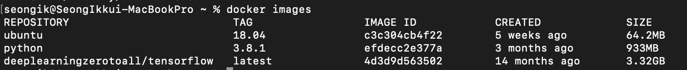
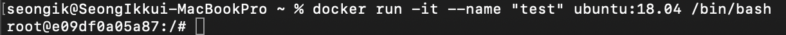
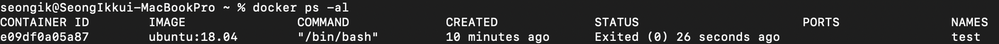
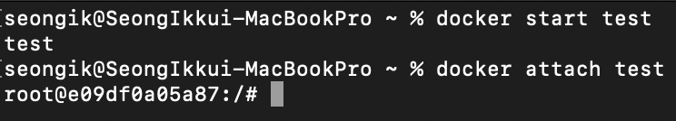
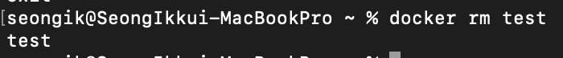
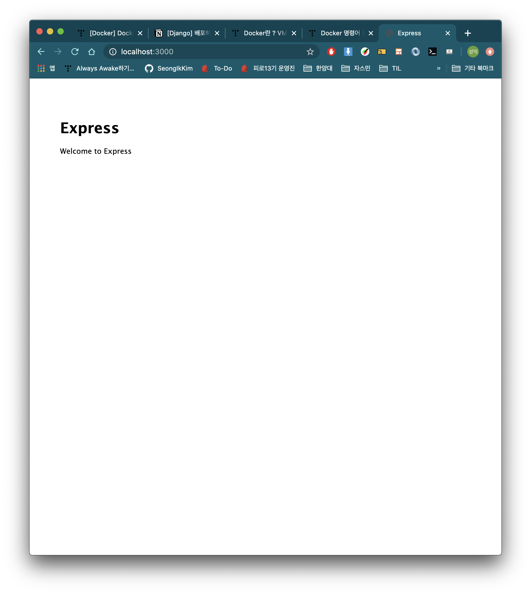
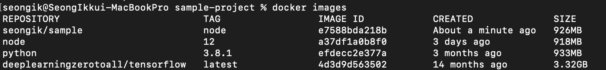
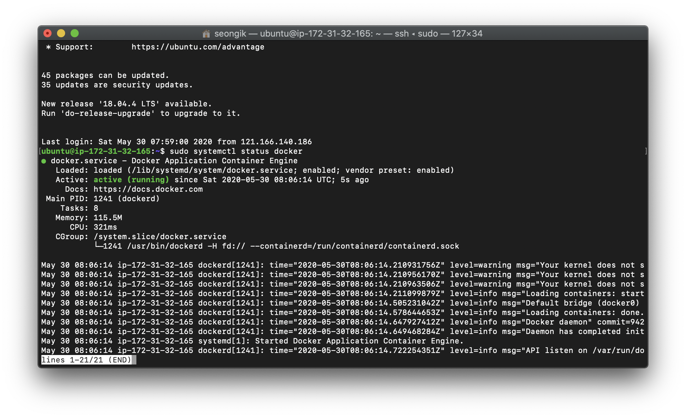
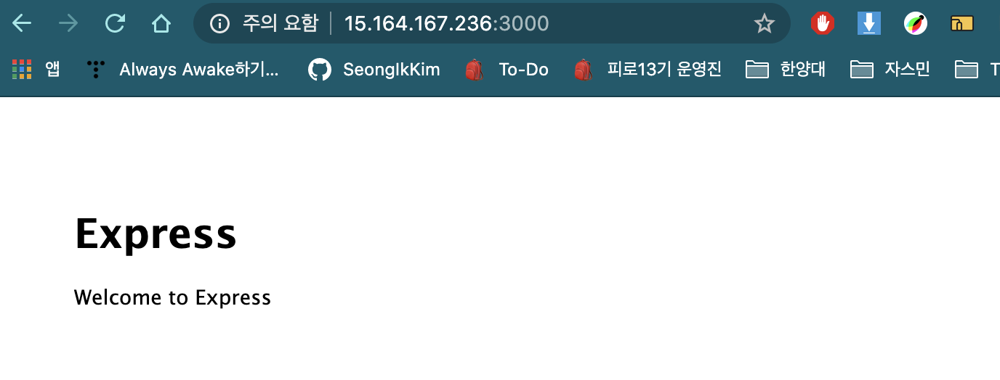

# 도커 간단히 따라하기

## 왜 Docker를 사용할까?

[왜 굳이 도커(컨테이너)를 써야 하나요? - 컨테이너를 사용해야 하는 이유](https://www.44bits.io/ko/post/why-should-i-use-docker-container)

→ 서버 환경을 git처럼 코드+시점으로 관리함으로써, 바탕환경에 구애받지 않고 동일한 서버환경을 어디에서나 구축할 수 있다.

도커 파일 == 서버 운영 기록
도커 이미지 == 도커 파일 + 실행 시점
도커 컨테이너 == 도커 이미지 + 환경변수

도커 파일이 서버의 운영 과정을 쭉 기록해놓은 하나의 역사책이라고 한다면, 도커 이미지는 특정 시점의 서버 모습을 틀(클래스)처럼 주조한 것이라고 할 수 있고, 컨테이너는 이미지를 바탕으로 찍어낸 실체(인스턴스)라고 할 수 있다.

이처럼 서버 코드화를 함으로써 

1. 서버 제작과정에 견고함과 유연성을 더하고
2. 다른 이가 만든 서버를 소프트웨어 사용하듯 갖다쓸 수 있고
3. 여러 대에 배포할 수 있는 확장성을 가질 수 있다.

- 이외에도...

    ## 도커로 개발환경을 구성해야하는 이유 - 사례로 설명

    [도커(Docker) 컴포즈를 활용하여 완벽한 개발 환경 구성하기](https://www.44bits.io/ko/post/almost-perfect-development-environment-with-docker-and-docker-compose#services)

    ## 도커와 VM의 차이

    [Docker란 ? VM과 차이, Docker 설치 및 기본 명령어를 중심으로](https://corona-world.tistory.com/15)

---

### Docker 명령어 훑어보기

[🐳 Docker 도커 - #1 기본 명령어 모음](https://velog.io/@wlsdud2194/-Docker-%EB%8F%84%EC%BB%A4-%EA%B8%B0%EB%B3%B8-%EB%AA%85%EB%A0%B9%EC%96%B4-%EB%AA%A8%EC%9D%8C)

[Docker 명령어 정리](https://iamreo.tistory.com/entry/Docker-%EB%AA%85%EB%A0%B9%EC%96%B4-%EC%A0%95%EB%A6%AC)

`docker <명령>` 형식으로 이루어지며, **항상 root권한**으로 실행해야한다.(root 사용자로 접근하지 않았다면 sudo를 붙일것)

---

# 도커 실습(서버 구축부터 AWS까지)

## Search로 도커 허브에서 이미지 검색하기

터미널(콘솔)창에서 `docker search [OPTIONS] 검색할이미지명` 을 사용해 원하는 이미지를 도커 허브에서 검색할 수 있다.

도커 허브 :  도커 이미지를 레포지토리에 등록하고 공유할 수 있는 서비스로, 코드를 공유하는 깃허브와 개념적으로 유사하다.

`docker search ubuntu` 를 검색하면 아래와 같은 도커허브의 많은 이미지들을 볼 수 있다. 이중 OFFICIAL [OK]는 공식 이미지이고, 나머지는 사용자들이 만든 이미지이다.


## pull로 이미지 다운받고 확인하기

`docker pull ubuntu:버전` 혹은 `docker pull <사용자이름>/ubuntu` 를 이용하여 해당 이미지를 로컬로 내려받는다.

우리는 docker pull ubuntu:18.04로 **ubuntu 18.04버전**을 사용할 것이다.

설치가 완료되었다면 `docker images` 명령어로 로컬에 존재하는 도커 이미지를 모두 볼 수 있다.



`docker rmi <이미지명>:<태그>`을 사용해서 사용하지 않을 이미지를 삭제할 수 있다.

*(docker rmi ubuntu 18.04)*

## Container 사용하기

- Container 명령어 정리
    - 컨테이너 생성
        - `docker create [OPTIONS] IMAGE [COMMAND] [ARG...]`  : 이미지로 컨테이너를 **생성만** 한다.
        - `docker run [OPTIONS] IMAGE [COMMAND] [ARG...]` : 이미지를 사용해서 컨테이너를 생성하고 **바로 실행까지 한다**.
    - 컨테이너 실행
        - `docker start [OPTIONS] CONTAINER [CONTAINER...]` : 중지 상태의 컨테이너 실행
        - `docker restart [OPTIONS] CONTAINER [CONTAINER...]` : 실행 중인 상태의 컨테이너 재실행(재부팅 개념)
    - 컨테이너 중지
        - `docker stop [OPTIONS] CONTAINER [CONTAINER...]` : 실행 상태의 컨테이너 중지
    - 컨테이너 삭제
        - `docker rm [OPTIONS] CONTAINER [CONTAINER...]`  : 컨테이너 삭제

`docker run -it --name "test" ubuntu:18.04 /bin/bash` 명령어로 ubuntu 18.04 이미지를 이용한 도커컨테이너 test를 만들어본다.

- 명령어 해석
    - -it : 현재 실행중인 터미널에 결과 출력 (-i와 -t 따로 사용할 수 있음)
    - —rm : 실행 후 컨테이너 바로 삭제
    - —name <컨테이너 이름> : 컨테이너 이름 지정
    - ubuntu:18.04 : 사용할 이미지 이름 선택
    - /bin/bash : 컨테이너 내부 접속 후 실행하는 커맨드 (접속하자마자 바로 터미널 켜기)



완료시 위와 같은 화면이 나온다.

이후 terminal과 같은 방식으로 컨테이너를 둘러볼 수 있다.

나가는 방법은 `exit` . exit하면 **자동으로 컨테이너가** **중지**된다. (= `ctrl` + `d`)

컨테이너를 **중지하지 않고** 빠져나오려면 `ctrl` + `p` + `q`입력. 

실행되고 있는 도커 컨테이너는 `docker ps` 를 통해서 확인할 수 있다.


중지된 컨테이너까지 모두 보려면 `docker ps -al` 을 사용한다.



중지된 컨테이너를 실행하기 위해 `docker start <컨테이너명>` 을 사용한다.

**start는 실행 명령어**이지, ****접속 명령어가 **아니다**. 따라서 컨테이너를 실행시켜 놓고 다시 root 터미널로 돌아온다.

만약 컨테이너에 다시 접속하고 싶다면 `docker attach <컨테이너명>`을 사용한다.



컨테이너에 접속하지 않은 상태로도 `docker exac <컨테이너명> <명령> <매개변수>` 로 컨테이너 내부에서 명령을 실행할 수 있다. apt-get이나 yum을 이용해 패키지나 각종 데몬을 실행할 때 사용된다.

`docker rm <컨테이너명>` 을 사용해서 사용하지 않을 컨테이너를 삭제할 수 있다.



이후 테스트에 사용되었던 ubuntu:18.04 이미지 파일을 삭제해도 된다.

`docker rmi ubuntu:18.04`

## Node.js 샘플 프로젝트 생성하기

프로젝트를 생성할 폴더로 이동하여 express 폴더를 생성한다. **express가 깔려있다는 전제하**에 작동한다.

```bash
#express로 프로젝트 생성
express sample-project

#sample-project로 이동
cd sample-project

#dependencies 설치
npm install

#서버가 실행되는지 확인
npm start
```



위와같이 3000번 포트에 Welcome to Express가 뜨면 성공이다.

### Docker file 작성

Docker file이란?  :  이미지를 만들어내기 위해 DSLDomain-specific language라는 자체 언어를 이용하여 생성과정을 적어두는것. Django에서 Django 환경을 일관성있게 유지하기 위해 의존성 패키지 설정파일 requirement.txt를 기록해두었는데, Docker Image도 이처럼 Dockerfile이라는 설계도를 통하여 구성된다.

Sample-project에 들어가 Dockerfile과 .dockerignore을 만들어준다.

Docker file은 어떤 이미지를 베이스로 만들어질 것인지 결정한다.

.dockerignore은 우리가 익히 알고있는 .gitignore과 유사한 방식으로 동작한다. 도커 이미지를 만들 때 굳이 포함되지 않아도 되는 폴더/파일 등을 제외시킬때 사용한다.

도커 이미지 파일에 node_modules 폴더가 들어가지 않도록 하기 위해 .dockerignore 파일을 설정해준다.

```docker
# .dockerignore

node_modules/
```

이후 Dockerfile을 설정한다. 

```docker
# Dockerfile

# Docker Hub 내에서 node의 LTS 버전인 12버전을 베이스 이미지로 한다
FROM node:12

# 도커 파일 생성/관리자 정보를 기록한다
MAINTAINER 생성자명 <이메일 주소>

# CMD에서 설정한 실행 파일이 실행될 디렉터리를 지정한다
WORKDIR /usr/src/app

# 베이스이미지에 Node.js와 npm이 있으므로 앱의 dependancies만 설치해준다
# npm 버전이 4 이상이라면 package.json과 package-lock.json을 모두 생성해주는 코드이다
COPY package*.json ./

RUN npm install

# 앱의 소스파일을 추가한다
COPY . .

# 가상머신에 오픈할 포트번호를 도커 데몬에 매핑한다
# 도커데몬 : docker API 요청을 수신하고 이미지, 컨테이너, 네트워크 및 볼륨같은 도커 객체를 관리한다
EXPOSE 3000

# 런타임을 정의하는 커맨드로 앱을 실행하는 명령어를 작성한다.
CMD ["npm", "start"]
```

위의 파일을 모두 작성했으면 다시 terminal로 돌아가 Dockerfile이 있는 디렉터리로 이동한 후, 도커 파일을 이용해 이미지를 빌드한다.

`docker build --tag <사용자 명>/<레포지토리 명>:<태그명> .` 명령어를 이용하여 이미지에 태그명을 붙인 상태로 빌드한다.

docker images로 로컬의 이미지를 확인하면, `seongik/sample` 이미지를 만들기 위해 먼저 `node:12` 이미지가 설치되었고, 그 이후 설정해둔 도커파일에 의해 이미지가 생성된 것을 확인할 수 있다.

```powershell
$ docker build --tag seongik/sample:node . 
Sending build context to Docker daemon  46.08kB
Step 1/8 : FROM node:12
 ---> a37df1a0b8f0
Step 2/8 : MAINTAINER <사용자 명> <이메일 명>
 ---> Running in 57c5b71979fb
Removing intermediate container 57c5b71979fb
 ---> 0c7a316c9795
Step 3/8 : WORKDIR /usr/src/app
 ---> Running in e7725e2f78cf
Removing intermediate container e7725e2f78cf
 ---> 4b29c8d39fc1
Step 4/8 : COPY package*.json ./
 ---> 2720ccae1e5d
Step 5/8 : RUN npm install
 ---> Running in 5b8f8ff5cd8e
added 100 packages from 139 contributors and audited 101 packages in 2.163s
found 4 vulnerabilities (3 low, 1 critical)
  run `npm audit fix` to fix them, or `npm audit` for details
Removing intermediate container 5b8f8ff5cd8e
 ---> 00d6d7027454
Step 6/8 : COPY . .
 ---> b73d028aa180
Step 7/8 : EXPOSE 3000
 ---> Running in 3eb1dc9189e4
Removing intermediate container 3eb1dc9189e4
 ---> b25319378f74
Step 8/8 : CMD ["npm", "start"]
 ---> Running in 966e67aa5e9b
Removing intermediate container 966e67aa5e9b
 ---> e7588bda218b
Successfully built e7588bda218b
Successfully tagged seongik/sample:node
```



이제 만들어진 이미지를 이용하여 컨테이너를 빌드해보자. 이번에는 컨테이너에 접속하지 않은채로 컨테이너가 서버를 수행하도록 백그라운드로 실행해놓고, 호스트의 포트에서 해당 로컬 포트에 접속해 볼것이다.

`docker run -d -p <호스트에서 접속할 포트>:<컨테이너에서 수행하는 포트> <username>/<이미지 명>:<태그명>`

- run 명령어 옵션 해석

    -d : (detached), 해당 컨테이너를 백그라운드로 실행시킨다(접속하지 않고 실행시킨다)

    -p : 컨테이너의 포트와 호스트의 포트를 연결시켜준다. 순서는 <호스트 포트>:<컨테이너포트> 순이다.

- 잠깐만! run이 안된다면?

    [개발자가 처음 Docker 접할때 오는 멘붕 몇가지 | Popit](https://www.popit.kr/%EA%B0%9C%EB%B0%9C%EC%9E%90%EA%B0%80-%EC%B2%98%EC%9D%8C-docker-%EC%A0%91%ED%95%A0%EB%95%8C-%EC%98%A4%EB%8A%94-%EB%A9%98%EB%B6%95-%EB%AA%87%EA%B0%80%EC%A7%80/)

    [[Docker Study] 3. 도커의 몇 몇 run 옵션들](https://m.blog.naver.com/alice_k106/220340499760)

docker run -d -p 8080:3000 <사용자명>/<이미지 명>:<태그명> 으로 컨테이너를 실행시켰다면, 컨테이너 내부의 express server가 npm start로 시작되어 3000포트에 서버로서 동작하고있고, 해당 3000포트가 호스트의 8080포트와 연결되어있으므로, [localhost:8080](http://localhost:8080) 포트에서 Express 서버의 동작을 확인할 수 있다.


이후 `Docker logs --follow <컨테이너 ID>` 로 해당 컨테이너의 로그를 확인할 수 있다. 아까 실행시켜둔 노드 컨테이너는 서버역할을 하고 있으므로 접속시의 로그가 찍혀나오는것을 볼 수 있다.


## 생성한 이미지 AWS에 배포하기

이전까지는 호스트와 컨테이너 모두 로컬 포트를 이용했기 때문에 로컬에서 컨테이너에 접근할 수 있었지만, 실제로 AWS에 배포하는 것은 어디에서나 웹을 통하여 접근하여 누구에게나 동일한 환경을 제공하는것이다. 따라서 노드 서버 프로세스관리자인 **pm2**를 사용할 것이다.

pm2란? :  노드 전용 프로세스 관리자로, 서버 에러나 로그, 자동 실행등의 많은 핸들링을 간편화 시켜주는 모듈이다.

- pm2에 관해서는 이것을 참조하자

    [노드를 더 우아하게. pm2 이야기](https://jybaek.tistory.com/716)

    [pm2에 대해 알아보자](https://ocsusu.tistory.com/26)

    [PM2를 활용한 Node.js 무중단 서비스하기 - LINE ENGINEERING](https://engineering.linecorp.com/ko/blog/pm2-nodejs/)

이전에 만들었던 도커 컨테이너와 빌드한 도커 이미지를 모두 삭제한다.

이후 Dockerfile을 수정해준다.

```docker
# Dockerfile

FROM node:12

MAINTAINER SeongIk Kim <kpic1638@gmail.com>

WORKDIR /usr/src/app

COPY package*.json ./

RUN npm install

# 추가된 부분 : pm2 설치
RUN npm install -g pm2

COPY . .

EXPOSE 3000

# 추가된 부분 : pm2로 run하기
CMD ["pm2-runtime","start", "./bin/www"]
```

이후 이미지를 다시 새로 빌드한다.

### Docker hub에 내 이미지 Push하기

`sudo docker login`을 통해 터미널에서 도커를 로그인해준다.(첫 비밀번호는 호스트 컴퓨터 사용자 비밀번호이고, 두번째 비밀번호는 docker hub 웹사이트 비밀번호이다.)

```bash
$ sudo docker login
Password:
Authenticating with existing credentials...
Stored credentials invalid or expired
Login with your Docker ID to push and pull images from Docker Hub. If you don't have a Docker ID, head over to https://hub.docker.com to create one.
Username (kpic5014): 
Password: 
Login Succeeded
```

이후 `docker push <사용자 명>/<레포지토리 명>:<태그 명>` 명령어를 이용해 docker hub에 내 이미지를 푸시한다.

- denied: requested access to the resource is denied 에러가 뜬다면?

    [[Docker CE] 도커 이미지 업로드 권한 에러 (denied: requested access to the resource is denied)](https://nirsa.tistory.com/53)

    해당 링크를 참조하자. 사용자명과 docker hub 네임이 맞지 않아서 생기는 문제일 가능성이 높다.

이후 AWS EC2 인스턴스에 접속한다.

- 만약 인스턴스가 없다면 이 링크를 참고하여 만들어보자.

    [[AWS] EC2 서버 사용하기](https://ooeunz.tistory.com/35)

EC2 인스턴스에 접속했다면,  아래의 명령어들을 입력해보자.

```bash
curl -fsSL https://get.docker.com/ | sudo sh
sudo usermod -aG docker $USER

sudo curl -L "https://github.com/docker/compose/releases/download/1.24.0/docker-compose-$(uname -s)-$(uname -m)" -o /usr/local/bin/docker-compose
sudo chmod +x /usr/local/bin/docker-compose

# check (re-login)
docker version
docker-compose version

# reboot
sudo reboot
```

자동으로 도커를 설치하고, reboot하는 명령어이다.

```bash
ubuntu@ip-172-31-32-165:~$ curl -fsSL https://get.docker.com/ | sudo sh
# Executing docker install script, commit: 26ff363bcf3b3f5a00498ac43694bf1c7d9ce16c
+ sh -c apt-get update -qq >/dev/null
+ sh -c DEBIAN_FRONTEND=noninteractive apt-get install -y -qq apt-transport-https ca-certificates curl >/dev/null
+ sh -c curl -fsSL "https://download.docker.com/linux/ubuntu/gpg" | apt-key add -qq - >/dev/null
+ sh -c echo "deb [arch=amd64] https://download.docker.com/linux/ubuntu xenial stable" > /etc/apt/sources.list.d/docker.list
+ sh -c apt-get update -qq >/dev/null
+ [ -n  ]
+ sh -c apt-get install -y -qq --no-install-recommends docker-ce >/dev/null
+ sh -c docker version
Client: Docker Engine - Community
 Version:           19.03.10
 API version:       1.40
 Go version:        go1.13.10
 Git commit:        9424aeaee9
 Built:             Thu May 28 22:17:05 2020
 OS/Arch:           linux/amd64
 Experimental:      false

Server: Docker Engine - Community
 Engine:
  Version:          19.03.10
  API version:      1.40 (minimum version 1.12)
  Go version:       go1.13.10
  Git commit:       9424aeaee9
  Built:            Thu May 28 22:15:37 2020
  OS/Arch:          linux/amd64
  Experimental:     false
 containerd:
  Version:          1.2.13
  GitCommit:        7ad184331fa3e55e52b890ea95e65ba581ae3429
 runc:
  Version:          1.0.0-rc10
  GitCommit:        dc9208a3303feef5b3839f4323d9beb36df0a9dd
 docker-init:
  Version:          0.18.0
  GitCommit:        fec3683
If you would like to use Docker as a non-root user, you should now consider
adding your user to the "docker" group with something like:

  sudo usermod -aG docker your-user

Remember that you will have to log out and back in for this to take effect!

WARNING: Adding a user to the "docker" group will grant the ability to run
         containers which can be used to obtain root privileges on the
         docker host.
         Refer to https://docs.docker.com/engine/security/security/#docker-daemon-attack-surface
         for more information.
ubuntu@ip-172-31-32-165:~$ sudo usermod -aG docker $USER
ubuntu@ip-172-31-32-165:~$ sudo curl -L "https://github.com/docker/compose/releases/download/1.24.0/docker-compose-$(uname -s)-$(uname -m)" -o /usr/local/bin/docker-compose
  % Total    % Received % Xferd  Average Speed   Time    Time     Time  Current
                                 Dload  Upload   Total   Spent    Left  Speed
100   638  100   638    0     0   1468      0 --:--:-- --:--:-- --:--:--  1470
100 15.4M  100 15.4M    0     0  3318k      0  0:00:04  0:00:04 --:--:-- 4512k
ubuntu@ip-172-31-32-165:~$ sudo chmod +x /usr/local/bin/docker-compose
ubuntu@ip-172-31-32-165:~$ docker version
Client: Docker Engine - Community
 Version:           19.03.10
 API version:       1.40
 Go version:        go1.13.10
 Git commit:        9424aeaee9
 Built:             Thu May 28 22:17:05 2020
 OS/Arch:           linux/amd64
 Experimental:      false
Got permission denied while trying to connect to the Docker daemon socket at unix:///var/run/docker.sock: Get http://%2Fvar%2Frun%2Fdocker.sock/v1.40/version: dial unix /var/run/docker.sock: connect: permission denied

ubuntu@ip-172-31-32-165:~$ docker-compose version
docker-compose version 1.24.0, build 0aa59064
docker-py version: 3.7.2
CPython version: 3.6.8
OpenSSL version: OpenSSL 1.1.0j  20 Nov 2018
```

위와 같은 화면이 나오는 것을 볼 수 있다.

`sudo systemctl status docker` 명령어를 이용해 도커가 제대로 설치되었는지 확인할 수 있다.



도커가 제대로 설치되었다면 이제 Docker Hub에 Push해두었던 도커 이미지를 내려받을 시간이다.

지금은 EC2 인스턴스의 ssh 서버에 접속해있으므로, ssh서버에서 `sudo docker login` 을 통해 docker 계정에 접속한다.

이후 `docker pull <사용자 명>/<레포지토리 명>:<태그명>` 으로 docker hub에 올려진 도커 이미지를 다운받는다.

```bash
ubuntu@ip-172-31-32-165:~$ sudo docker pull kpic5014/sample:node
node: Pulling from kpic5014/sample
1c6172af85ee: Pull complete 
b194b0e3c928: Pull complete 
1f5ec00f35d5: Pull complete 
93b1353672b6: Pull complete 
3d7f38db3cca: Pull complete 
21e102f9fe89: Pull complete 
42367c0e61d0: Pull complete 
647509a3a3f6: Pull complete 
0d4135ddc440: Pull complete 
a6ed72cd3d79: Pull complete 
abec976f329a: Pull complete 
40faa714ac6b: Pull complete 
85bbb3035b0c: Pull complete 
455f47466c8d: Pull complete 
Digest: sha256:69ea37b77d18a886faf84dc462d8468ec5622bf8d100034823b9b61982f80599
Status: Downloaded newer image for kpic5014/sample:node
docker.io/kpic5014/sample:node
```

이제 받아진 도커 이미지를 토대로 docker container를 run해주면, 로컬에서 만들어두었던 express 서버가 그대로 AWS 인스턴스에서도 적용된다.

`docker run -t -i -p <포워딩할 포트(웹에 올라갈 포트)>:<ssh 컨테이너 포트> <사용자명>/<레포지토리명>:<태그명>`

- 잠깐! run 옵션이 잘 기억이 안난다면..

    -t + -i :(tty, interactive) -it로도 쓸 수 있으며, 이 옵션을 줘야 컨테이너 내에서 터미널을 실행할 수 있다.

    -p [호스트 포트: 컨테이너 포트] : 컨테이너의 포트와 호스트의 포트를 연결시켜준다.



`해당 인스턴스 IP주소(탄력적 IP):포트번호` 로 접속하면 AWS 인스턴스에서 배포한 간단한 Express 서버를 전 세계 어느곳에서나 접속할 수 있다.

```bash
ubuntu@ip-172-31-32-165:~$ sudo docker run -t -i -p 3000:3000 kpic5014/sample:node
2020-05-30T08:18:59: PM2 log: Launching in no daemon mode
2020-05-30T08:18:59: PM2 log: App [www:0] starting in -fork mode-
2020-05-30T08:18:59: PM2 log: App [www:0] online
GET / 200 206.113 ms - 170
GET /stylesheets/style.css 200 3.046 ms - 111
GET /favicon.ico 404 14.930 ms - 942
```

해당 접속 기록이 서버를 수행하고있는 ssh 컨테이너에 기록되는 것을 볼 수 있다.

이로서 Docker를 이용한 간단한 Express 서버 배포끝!

---

메인 레퍼런스는 아래 주소를 참조했으며, 이 문서는 아래 문서를 거의 옮겨놓은 수준입니다. 문제가 있다면 꼭 이 레퍼런스를 참조하세요!

[[Docker] Docker Tutorial (1) : 기본적인 사용법](https://ooeunz.tistory.com/68?category=821628)