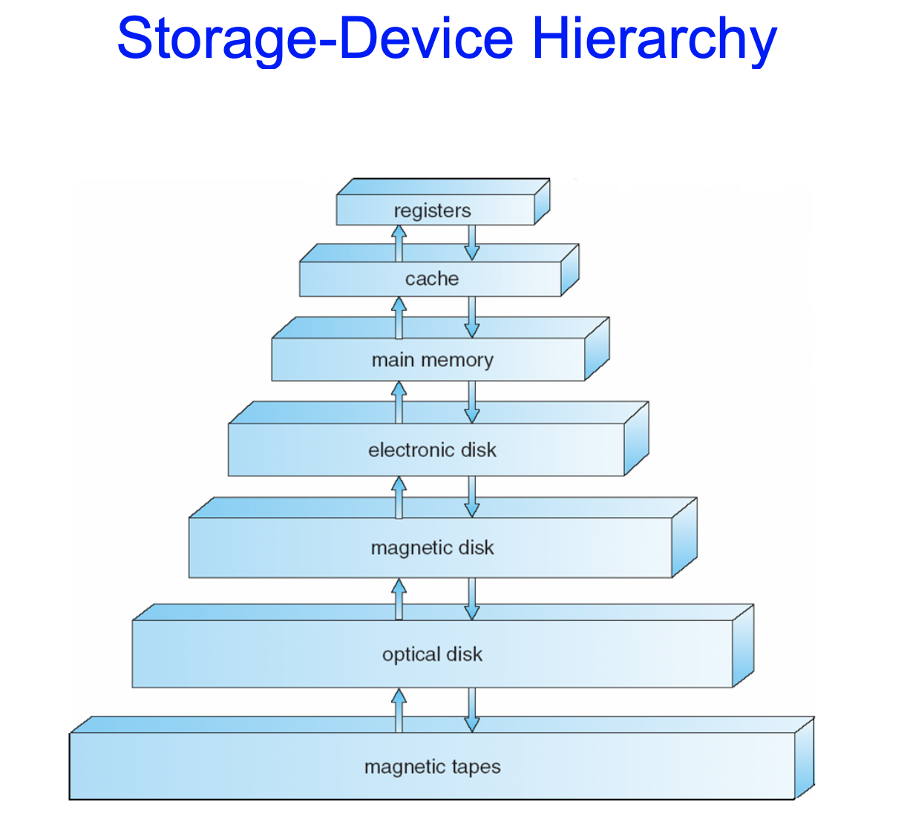

OS 정리 2
========
Chapter 1
---------

# Interrupt

* hardware와 software는 어떤 event가 발생했을 때 signal을 보내는데, 이를 `interrupt`라고 한다.
    - 하드웨어는 어느 순간이든 system bus를 통하여 cpu에 신호를 보내 intterupt를 trigger할 수 있다.
    - 소프트웨어는 `system call`이라는 특별한 연산을 실행하여 intterupt를 trigger할 수 있다.

* CPU가 interrupt되면
    1. 하던일을 중단하고
    2. 즉시 fixed location으로 실행을 transfer한다. 이러한 fixed location은 innterupt가 위치한 service routine의 시작 주소를 가지고있다.
    3. interrupt service routine이 실행된다.
    4. 실행이 완료되면, CPU는 interrupt 되었던 연산을 재개한다.

* service routine들의 주소를 담아놓은 곳을 __interrupt vector__ 라고 한다. 인터럽트는 매우 빠르게 처리되어야하고, 사용가능한 인터럽트들의 수가 정의되어 있으므로 대신 인터럽트 루틴에 대한 포인터들의 테이블(interrupt vector)를 이용하는 것이다. 이 테이블은 하위 메모리의 첫 100개정도의 위치에 저장되어있으며, 고유의 장치 번호로 색인된다.

* 인터럽트 구조는 interrupted instruction-원래 하던 일-의 address를 반드시 저장해야한다.

* Lost interrupt를 예방하기 위하여 incoming interrupts는 다른 어떤 interrupt가 실행되고 있는 동안 disable된다.

* `trap`은 error나 user request에 의해 유발된 __sorftware-generated__ interupt이다. ex)division by zero

* OS는 __interrupt driven__방식이다.

## Interrupt Handling

- 최근 구조들은 fixed location에 인터럽트 주소를 저장하지 않고 system stack에 복귀 주소를 저장한다.
- 만약 interrupt routine이 처리기의 상태를 변경(ex-레지스터 값 변경)해야하면, 인터럽트 루틴은 반드시 명시적으로 현재 상태를 저장하여야하고, 복귀하기 전에 상태를 복원해야한다.(함수 subroutine 생각해두면 될듯)
- 인터럽트 서비스 후 저장되어있던 복귀주소를 program counter에 적재하고, 중단되었던 일을 아무 일도 없었던 것처럼 다시 재개한다.   
*program counter:인터럽트 하기 전의 일로 돌아가기 위해 진행되던 일의 address를 저장해두는 곳이다.
- process 1이 실행되는 과정 그림 참조

***

# I/O Structure

* I/O란?
    - Input과 Output(입출력)
    - device들과 memory/local buffer간의 데이터 이동
    - Devices ex) 키보드, 모니터, 마우스, 디스크 등

* Device Controller
    - common bus로 연결된 hardware
    - 1개 또는 그 이상의 디바이스가 하나의 controller에 연결될 수 있다.
    - 약간의 local buffer stroage와 a set of special-purpose registers를 가지고 있다.
    - local buffer storage과 peripheral devices주변기기 사이의 데이터 이동을 담당하고 있다.

* Device Driver
    - OS는 각 device controller마다 device driver를 가지고있다.
    - divice controller의 동작을 이해하고, 운영 체제 내의 다른 부분들에게 uniform interface를 제공한다.
    
* I/O operation을 실행하기 위하여
    - driver는 controller의 적절한 register에 필요한 값을 set한다.
    - controller는 device로부터 local buffer로 데이터를 이동시키기 시작한다.
    - 완료하면, controller는 device driver에게 interrupt로 끝났음을 알린다informs.
    - device driver는 OS에게 control을 넘겨준다.
    - OS는 data를 읽어들인다.
    
* Synchronous I/O
    - I/O가 시작되면, 끝나야지만 user program으로 control이 넘어간다.
    - 다음 인터럽트가 발생할 때 까지 CPU에 wait instruction을 내린다.

* Asynchronous I/O
    - I/O가 시작되면, 완료되기까지 기다리지 않고 바로 user program으로 control을 넘긴다.

그러나 이 인터럽트 구동 방식의 입출력은 적은 양의 데이터를 전송하는데에는 문제가 없으나, 디스크입출력과 같은 대량의 데이터 전송시 높은 overhead를 초래한다. 따라서 이 문제를 해결하기 위해 직접메모리접근Direct memory Access장치가 사용된다.

## Direct memory Access, DMA

- 메모리속도에 가깝게 정보를 전송할 수 있는 high-speed I/O devices에 사용된다.
- controller는 CPU의 intervention 없이 buffer storage에서 main memory로(또는 역으로) 바로 blocks of data를 전송한다.
- byte마다 하나의 interrupt가 아니라, block마다 하나의 interrupt가 만들어진다.즉, 한번의 인터럽트에 최대한 많은 내용을 담을 수 있도록 한다.
- controller가 transmit하고있는동안 CPU는 다른 일을 처리할 수 있다.

***

# Storage Structure

+ CPU는 오직 메모리로부터 명령을 적재할 수 있으며, 실행하고자 하는 프로그램은 모두 메모리에 저장된다.   
*적재load : 주메모리로부터 CPU내부의 레지스터로 한 워드를 옮기는 것   
*저장store : 레지스터의 내용을 주 메모리로 옮기는 것

+ Memory devices는 연속적인 메모리 주소만을 인식하며, 간접주소/명령카운터/색인 등이 어떻게 생성되고, 무엇인지(명령인지 데이터인지)등을 전혀 알지 못한다. 따라서 메모리 주소가 어떻게 생성되었는지에 관해서는 몰라도된다(특정 주소에 있는것은 명령이고, 특정 주소에 있는 것은 데이터이고.. 이런 법칙이 없으므로). 우리는 단지 실행 중인 프로그램에 의해 생성된 a set of memory addresses만 신경쓰면된다.

* Main memory주메모리 - CPU가 직접 접근할 수 있는 유일한 large storage media.
    - **Random access(RAM)**
    - 일반적으로 휘발성volatile 메모리이다

* Secondary storage - main memory의 extension이며 비휘발성, 대용량 저장장치

* Magnetic dists자기 테이프 - 자기기록물질로 덮인 금속/유리 platters
    - Disk 표면은 track으로 나누어져 있고, track은 sector로 나누어져 있다.
    - disk controller는 device와 computer사이의 논리 상호작용을 담당한다

## Storage Hierarchy

* Storage system은 계층으로 나열되어있다.
    - 속도Speed
    - 가격Cost
    - 휘발성Volatility
    + 크기

+ 상위수준으로 갈수록 cost가 비싸고 speed가 빠르다. 아래쪽으로 갈 수록 비트당 cost는 감소하고, 접근 시간speed는 감소한다.

+ electron disk 이상의 저장장치들은 volatile이며, 그 아래의 장치들은 nonvolatile이다. electron disk는 volatile과 nonvolatile 두 가지 중 하나로 설계할 수 있다.

## `Caching`
더 빠른(상위의) 저장장치로 information을 copy하는것. _main memory는 secondary storage의 cache_ 로 볼 수 있다. 이후 챕터에서 더 자세히 설명한다(중요한 개념)

* 하드웨어, OS, 소프트웨어어 같은 컴퓨터의 많은 부분에서 사용되는 중요한 원칙이다.

* 임시적으로 사용할 정보를 slower->faster storage로 복사해온다.

* Faster storage(Cache)는 먼저 information is there인지 확인한다.
    - 있다면, chace에서 바로 information을 꺼내다가 쓴다(fast)
    - 없다면, data를 cache로 copy해와서 사용한다.
    
* cache는 cached storage보다 작다.
    - cache 관리는 중요한 디자이닝 문제이다.
    - cache size와 replacement policy
