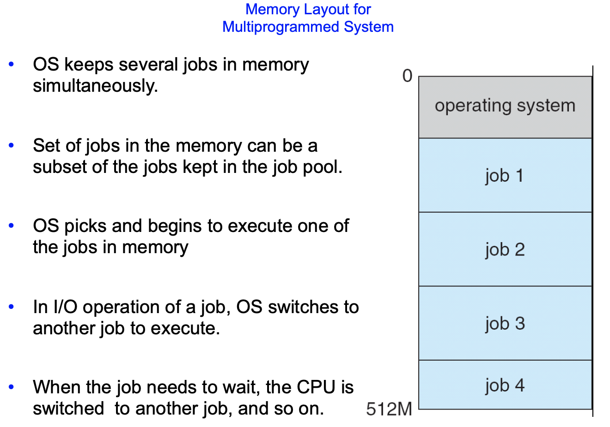

OS 정리 2

=========

Chapter 1

--------------

## cache과 buffer

- 공통점 : 메모리를 추가적으로 사용하여 속도차이를 보상한다(더 빠른 연산 처리를 위해 사용된다).

- 차이점

  - cache는 속도 및 저장용량 측면에서 두 기억 장치의 **중간**에 있고, 하나의 기억장치로서 역할을 수행한다. 즉, **한번 저장한 것을 계속해서 저장하여 가지고 있고**, 접근 요청이 발생할 때마다 꺼내서 반환해줄 수 있다.

  - buffer는 처리 크기가 일반적으로 큰 편으로, 모든 데이터를 저장 할 수 없다. 따라서 데이터를 잠시 담았다가 처리가 끝나면 __데이터를 폐기__한다

- buffering은 buffer로 data가 오지 않거나 / buffer가 느려서 보여줄 정보를 모두 가져오지 못했을 때 발생한다.

* [참조 - 캐시와 버퍼의 차이를 알아보자!](https://m.blog.naver.com/PostView.nhn?blogId=ndb796&logNo=221034787078&proxyReferer=https:%2F%2Fwww.google.com%2F)

# Computer System Structure

* 대부분의 시스템은 single general-purpose processor를 사용한다.
  * 대부분의 시스템은 special-purpose processors도 가지고있다. ex- 키보드 processor, graphic controller...
* `Multiprocessor` 시스템이 점점 사용도 많아지고, 중요해지고 있다.
  * parallel systems 또는 tightly-coupled systems로도 불린다.
  * 이점
    * 증가된 처리량_Increased throughput_ : processor 수를 증가시킴으로써 짧은 시간 안에 더 많은 일을 처리할 수 있다. 그러나, N개의 processor를 사용한다고 해도 속도 증가율은 N배보다 작다. 모든 부분이 정확히 동작하기 위해 약간의 overhead와 공유자원에 대한 경쟁이 유발되기 때문이다.
    * 규모의 경제_Economy of scale_ : 여러 프로그램이 동일한 데이터 집합에 대해 연산한다면, 하나의 디스크에 데이터가 저장되어 있고 모든 processor가 이를 공유하게 하는 것이 processor 각각에 대하여 로컬디스크와 데이터의 복사본을  갖게 하는 것보다 효율적이다.
    * 증가된 신뢰성_Increased reliability_ - 여러개의 processor가 있다면 하나의 processor가 고장나더라도 시스템이 정지하는 것이 아니라 속도만 느려지게 된다. 10개의 processor 중 1개가 고장난다면 나머지 9개가 고장난 processor의 작업을 나누면 된다. 이처럼 살아남은 하드웨어의 수준에 비례해 계속적으로 서비스를 제공하는 능력을 _graceful degradation_이라고 한다. 어떤 시스템은 구성요소가 고장나더라도 동작을 계속하면서 오류를 탐지하고, 진단하고, 가능하다면 교정하도록 하는 기법이 갖추어져있다. 이를 _fault tolerance_ 라고한다.
  * 종류(2가지)
    * Asymmetric Multiprogramming - 하나의 processor가 시스템을 제어하고, 나머지 processor들은 그 명령을 실행한다.(주종관계)
    * Symmetric Multiprogramming - 모든 processor가 대등하다.

*Clustered Systems에 대해서는 이후에 설명한다.

# Operating System Architecture

* 효율성을 위해 `Multiprogramming`이 필요하다.
  * 단일 프로그램Single user는 CPU와 I/O devices를 항상 바쁘게 유지할 수 없다.
  * Multiprogramming은 jobs(code and data)를 organize하여 CPU가 항상 하나의 작업을 수행하고 있도록 함으로써 CPU 이용률을 증가시킨다.
  * Main memory는 모든 jobs를 저장하기엔 너무 작기때문에, 작업들은 처음에는 disk내의 jobs pool에 유지되다가 주 메모리에 그 pool의 subset만 할당된다. (subset of total system is kept in memory)
  * `job scheduling` 을 통하여 하나의 작업이 선택되고 실행된다.
  * wait해야 할 때(예를 들어 입출력의 종료를 기다릴 때), multiprogramming OS는 다른 job으로 switch한다.
* `Timesharing(=multitasking)`은 multiprogramming의 logical extension으로, CPU가 매우 빈번하게 jobs를 switch하기 때문에 프로그램이 실행되는 동안 사용자들은 각자 자기의 프로그램과 interact할 수 있다. 이는 `interactive computing`을 만든다.
  * 사용자는 입력 장치를 통하여 OS나 program에 직접 명령하고, 출력장치의 응답을 기다린다. 이 response time은 1초 미만이다.
  * 각 사용자는 메모리에 하나의 독립된 program을 가지고 있다. 메모리에 적재되어 있으면서, executing되고 있는 program을 _process_라고 한다.
  * 여러개의 jobs가 동시에 실행 준비가 되어있으면, 시스템은 그들 중 하나를 선택해야 한다. 이 결정을 내리는 것을 _CPU scheduling_이라고 한다.
  * _Virtual memory_는 프로그램이 main memory의 실제 크기보다 크더라도 수용 가능하게 만들어주는 기법이다. 프로그램 전체의 코드중 사실 자주 사용되는 부분은 일부분으로, 나머지 부분들(예를들어 오류처리나 메모리를 과도하게 크게 잡은 코드들)은 거의 사용되지 않는다. 따라서 실행에 필요한 코드와 데이터만 메모리의 적재(물리 주소 할당)하고, 나머지는 가상의 메모리 주소를 주어 가상 주소 공간에 뒀다가 이후 필요할 때 메모리 관리장치(MMU)에 의해 물리 주소로 변환시킨다.

MS-DOS 같은 CLI 인터페이스는 multitasking이 불가능한 형식으로, 한번에 하나의 작업만을 수행할 수 있다. 위의 그림으로 따지자면 job이 딱 하나뿐인 것이다.

# Operating System Operations

* 현대의 OS는 Interrupt driven by hardware이다.
* software error 또는 request는 exception 또는 __trap__을 유발시킨다.
  * trap은 오류(ex- Division by zero), 또는 OS service 실행 요청에 의해 유발되는 _software에 의해 생성된 인터럽트_이다.
  * Multiprogramming 환경에서는 한 프로세스의 버그(ex- infinite loop)로 인하여 다른 프로세스의 정상적인 동작을 방해할 수 있으므로, 어떤 프로그램의 오류가 그 프로그램에만 문제를 일으키도록 보장해야한다.
* `Dual-mode` operation은 OS가 자신과 다른 system component들을 보호하기 위해 두개의 독립된 동작 모드를 구분하는 방법이다.
  * `User Mode` : 시스템이 사용자 응용을 위해 실행될 때
  * `Kernel Mode` : supervisor mode, system mode, privileged mode라고도 불린다. 사용자 응용이 OS에 서비스를 호출하면(system call) 커널모드로 전환된다.
  * `Mode bit`는 현재의 모드를 나타내는 비트(커널:0 or 유저:1)로 hardware에 있다.
    * system이 user code를 실행하고있는지(User mode), kernel code를 실행하고있는지(kernel mode)를 구별한다.
    * __previleged instructions__는 kernel mode에서만 실행 가능한 명령어이다. ex-커널모드로 전환, 입출력 제어, 타이머 관리, 인터럽트 관리...
    * system call은 kernel 모드로 전환시키고, call에서 복귀하면 다시 사용자 모드로 전환된다.

## Transition from User to Kernel Mode

* system 부팅시, hardware는 kernel mode로 시작한다.
* OS가 로드되고 난 뒤 User mode에서 user applications(processes)가 실행된다.
* trap 또는 interrupt가 발생할 때 마다, hardwares는 _user mode_에서 _kernel mode_로 변경한다 (커널 모드의 mode bit는 0으로 변경된다)

* 그러므로 OS가 컴퓨터의 제어를 얻을때마다 항상 kernel mode에 있다고 보면 된다.
* system은 _user program_에게 제어를 넘겨주기 전에 _user mode_로 변경한다(mode bit = 1로 변경

##### @interrupt란?

> You can think of an interrupt as an event that is generated (or “raised”) by hardware or software.

interrupt는 hardware/software에서 일어난 event 모두를 가리킨다.

> A hardware interrupt is raised by a hardware device to notify the kernel that a particular event has occurred. A common example of this type of interrupt is an interrupt generated when a NIC receives a packet.

hardware interrupt는 하드웨어 장치가 kernel에 특정 이벤트가 일어났음을 알려주는 용도로 사용된다. 예시 - 커뮤니케이팅 네트워크인 NIC가 packet을 받았을 때, data를 main memory로 내려받았으니 OS에 이제 사용할 수 있다고 알려주는 것

> A software interrupt is raised by executing a piece of code. On x86-64 systems, a software interrupt can be raised by executing the `int` instruction.

software interrupt는 code를 실행했을 때 일어나는 것이다.

## Timer

* OS는 CPU에 대한 제어를 maintain할 수 있도록 보장되어야한다.
* OS는 User program이 아래와 같은 상황에 빠지는 것을 막아야한다.
  * infinite loop에 빠지는것
  * system services를 call하지 않는것
  * 그래서 OS로 control을 return하지 않는것
* _infinite loop_를 막기위한 Timer | _process hogging resources_
  * specific period 이후에 interrupt를 발생시키도록 세팅해둔다(fixed timer)
  * OS는 counter를 감소시킨다(variable timer)
    * counter가 zero가 되면 interrupt가 발생한다
* user에게 control을 넘겨주기 전에,  OS는 timer가 interrupt를 발생시키도록 설정되어있는지를 ensure한다.
  * timer가 interrupt를 하면, controll은 자동적으로 OS로 넘어가게 된다.