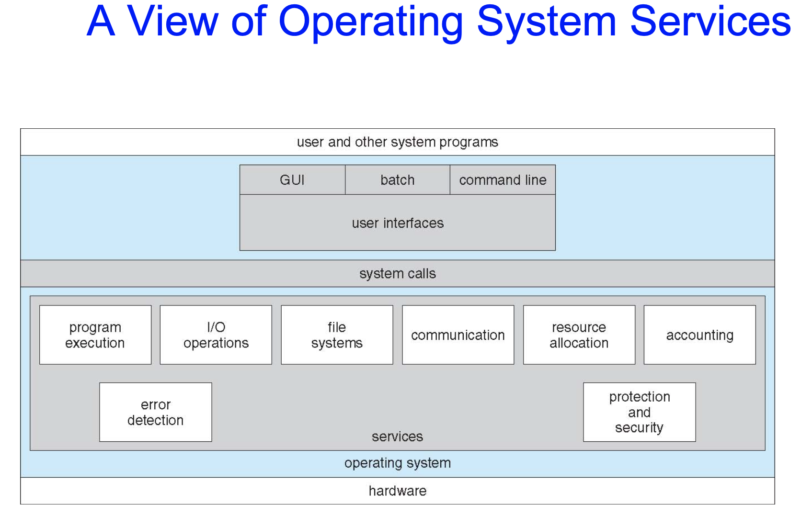
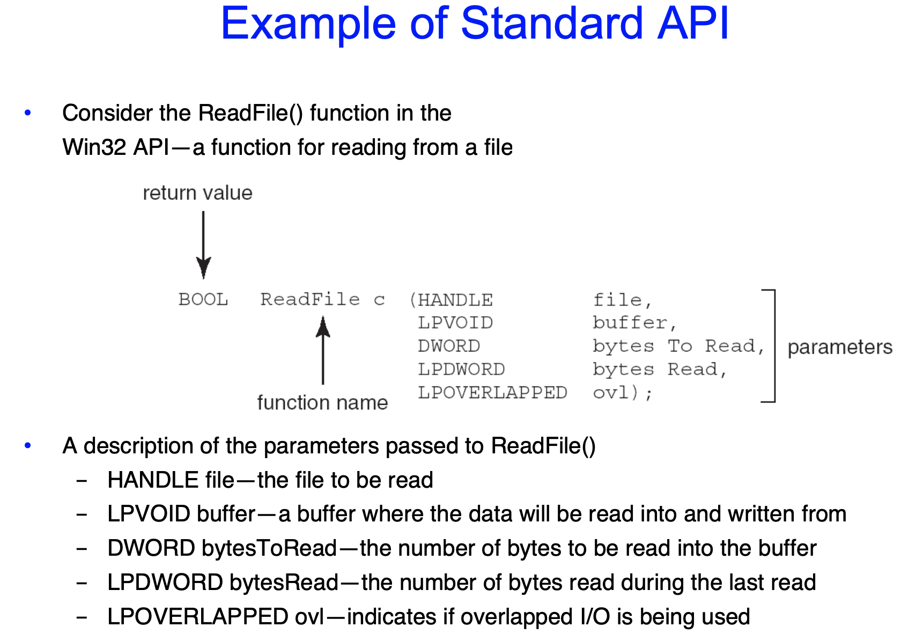

OS 정리 4
=========

Chapter 1
---------------

## Process Management

* process는 **execution중인 program**을 의미한다. 시스템에서 work의 한 단위이다. program은 _*passive entity_이고, process는 _*active entity_이다.

  *passive entity : 실행시켜주어야 돌아가는 stable static lines of code라고 생각하면 된다.

  *active entity : 현재(currently) 돌아가고 있는 entity이다. program counter를 내장하고있다.

* process는 task를 처리하기 위해 resources를 필요로한다.

  * CPU, memory, I/O, files
  * Initialization data

* process 제거는 OS가 할당해주었던 메모리를 다시 OS에 반환한다.reclaim of any reusable resources

* 싱글스레드 process는 다음에 수행할 instruction의 주소가 저장된 하나의 `program counter` 를 가지고 있다.
  * process는 완료될 때까지 한번에 하나씩 instruction을 순차적으로 수행한다
* 멀티스레드 process는 thread마다 하나의 program counter를 가지고 있다.

## Memory Management

* All data in memory before and after processing.
* 메모리의 모든 instruction은 순서에 따라 execute된다.
* memory management는 CPU 사용이나 사용자가 느끼는 컴퓨터 응답속도를 최적화할 때 무엇이 memory에 들어가 있을지 결정한다.
* memory management가 하는 역할은 다음과 같다.
  * 메모리의 어느 부분이 사용되고 있으며, 누구에 의해 사용되고 있는지를 추적한다
  * 어떤 프로세스(또는 그 일부)들을 메모리에 적재하고 제거할 것인가를 결정한다.
  * 필요에 따라 메모리 공간을 할당하고 회수한다.

이후 슬라이드는 추후에.

## Distributed Computing

* 물리적으로 떨어진, 이기종heterogeneous일 수 있는 컴퓨터들의 집합. 네트워크로 연결되어있다.
  * Network는 두 개 이상의 시스템간의 통신 경로이다.
    * Local Area Network (LAN) - 한 방, 한 층, 또는 한 건물을 연결
    * Wide area Network (WAN) - 건물, 도시 또는 국가 사이를 연결
    * Metropolitan Area Network (MAN) - 한 도시 내의 건물들 연결

* Network Operating System은 네트워크를 통하여 시스템들간의 features(파일, 메시지 등)를 공유한다.

  * 시스템들이 서로 exchange messages할 수 있다
  * 분산 운영체제는 illusion of a single system을 제공한다
  * ex- IPC
  * 추후에 더 설명

  

  ## Special-Purpose Systems

* Real-Time embedded system은 가장 유행하는prevalent 컴퓨터의 형태이다.

  * 매우 다양하며, 특수 목적을 가지거나, 필요한 기능만을 제공하는 내장형 운영체제를 가지고 있기도 하다. 실시간 운영체제real-time OS를 실행한다.
  * 예를 들어 ktx 열차에 사용되는 OS같은 것들은 open/close, run/stop 같은 특수한 목적으로 즉각 수행해야하는 embedded system을 사용할 것이다.

* Multimedia systems

  * 특정 시간 제약조건time restrcitions에 따라 전달되어야한다

* HandHeld systems

  * PDA, smart phones, limited CPU, memory, power
  * 휴대용 처리기는 배터리를 소모하므로 전력문제가 있어, processor의 속도를 제한하고 reduced feature set OS를 가진다. 또, 화면크기가 제한되어 있어 I/O의 선택지도 제한된다.

#	chapter 2

##	Operating System Services

* OS는 유저와 프로그램에게 프로그램의 실행을 위한 환경을 제공해준다.
* 운영체제 서비스는 유저에게 유용한 functions를 제공한다.
  * __User Interface__ : 거의 모든 OS는 UI를 제공한다.
    * CLI, GUI, Batch로 나누어진다.
  * __Program execution__ : 프로그램을 메모리로 불러와 수행할 수 있어야한다. 프로그램은 정상적이든 비정상적이든(에러를 표시하면서) 수행을 종료할 수 있어야한다.
  * __I/O operation__ : 실행중인 프로그램은 file이나 I/O 기기를 포함하는 I/O를 요구할 수있다. ex) 마우스, DVD, 외장하드
  * __File-system manipulation__ : 파일시스템은 특히 중요하다. 프로그램은 파일과 폴더를 읽고 쓰며, 만들거나 지우고, 지정된 파일을 찾고, 파일 정보를 리스트화하고, management 권한을 이용하여 접근을 허가/거부할 수 있어야한다.  
  * __Communications__ : process들은 같은 컴퓨터 내에서나, 네트워크를 통해 물리적으로 떨어진 컴퓨터끼리 information을 exchange할 수 있다.
    * shared memory나 message passing(패킷이 운영체제에 의해 프로세스간을 이동한다)방법이 사용된다.
  * __Error detection__ : OS는 모든 가능한 오류를 항상 의식하고 있어야한다.
    * CPU와 메모리 하드웨어, 입출력기기, 유저 프로그램에 의해 일어날 수 있다
    * 각 타입의 에러에서, OS는 올바르고 일관적인 처리를 위한 적절한 action을 취해야 한다
    * 디버깅 설비debugging facilities는 유저와 프로그램의 시스템 효율적 사용 능력을 크게 높일수 있다.
* OS의 다른 functions는 사용자를 위한 것이 아니라 시스템 자체의 효율적인 동작을 보장하기 위한 것이다. 다수의 사용자가 있는 시스템에서는 사용자들 간에 resource sharing을 통해 효율성을 얻을 수 있다.
  * __Resource Allocation__ : 다수의 사용자나 다수의 작업이 동시에 수행될때, resources는 각각에 대해 할당되어야한다.
    * OS는 여러가지 종류의 resource를 관리한다 : CPU cycles, main memory, file storage같은 것들은 특수한 allocation code를 가질 수 있는 반면, I/O devices 같은 다른것들은 훨씬 일반적인 request와 release code를 가지고있다.
  * __Accounting__ : 어떤 user가 어떤 종류의 resource를 얼마만큼 썼는지 기록한다.
  * __Protection and Security__  : 다수의 사용자가 있는, 또는 네트워킹된 컴퓨터시스템에 저장되어있는 정보의 owner는 해당 정보의 사용을 통제하고싶어할수도 있다. 서로 다른 여러 프로세스들이 동시에 실행될 때 한 프로세스가 다른 프로세스나 운영체제 자체를 interfere 해서는 안된다.
    * __Protection__ 은 system resource로의 모든 접근이 통제되도록 보장하는것을 포함한다.
    * 외부로부터의 시스템 __Security__는 사용자 authentication로부터 시작하며, 외부 입출력장치들을 부적합한 접근 시도로부터 지키는 것까지 포함한다.
    * 만약 시스템이 protected and secure해지려면, 시스템 전체에 걸쳐 예방책precaution이 institute 되어야한다. 하나의 chain은 그것의 weakest link만큼만 강하다.

### CLI

Command Line Interface(CLI)또는 __명령해석기Command Interpreter__는 direct command entry를 가능하게 한다.

* kernel에 의해 수행되거나, system program에 의해 수행되기도한다.
* 선택할 수 있는 여러 명령어 해석기multiple flavors를 제공하는 해석기는 __shell__이라고 불린다. (요새는 shell보다는 lancher의 형식으로 사용되고있다).
  * UNIX나 Linux에서는 BASH(Bourne_Again SHell), CSH(C SHell), KSH(Korn SHell), TCSH등을 포함하여 사용자가 선택할 수 있는 여러 shell이 제공된다.
  * 윈도우에는 CMD가 있다.
* 일차적으로 사용자로부터 command를 fetch해와서 execute한다.
  * 이 커맨드들 중 어떤 것들은 명령해석기 내에 built-in되어있고(이 경우 구현코드가 해석기 내에 들어가야 하므로 해석기의 크기가 커진다), 어떤것들은 program의 name만 가지고 있어 해당 파일을 실행함으로써 명령을 수행한다. 이 경우 해석기는 아주 작아질 수 있고, 프로그래머는 파일을 추가함으로써 쉽게 명령을 추가할 수 있다(ex- Unix에서의 rm명령어)

### GUI

* 사용자 친화적인 __desktop__ metaphor 인터페이스
  * 일반적으로 마우스, 키보드, 모니터 사용
  * __Icons__ 는 파일, 프로그램, 시스템 기능 등을 나타낸다
  * 마우스 포인터 위치에 따라 마우스 버튼을 누름으로써 명령을 수행할 수 있음
  * Xerox PARC에 의해 발명되었고, Apple Macintosh에 의해 널리 사용됨
* 대부분의 시스템은 이제 CLI와 GUI를 모두 제공한다.
  * 마이크로소프트 Windows의 GUI와 shell CLI "command"
  * 애플 Mac OS X의 GUI "Aqua"(부분적으로 UNIX kernel을 이용해 구현되었음)와 shell들
  * Solaris는 CLI만으로 이루어져있는데, GNOM이나 KDE같은 GUI를 추가적으로 더 깔수도 있다.

## System Calls

* OS가 제공하는 서비스에 대한 인터페이스를 제공한다.
* 하드웨어를 제어해야하는 저수준 작업은 어셈블리명령어를 사용하여 작성되어야 하더라도 이러한 호출은 일반적으로 C와 C++같은 high-level language로 작성된 routine형태로 제공된다.
* 프로그래머에 접근될 때 direct system call보다는 high-level __Application Program Interface(API)__에 따라 설계된다. direct system call은 파일 copy 수준의 간단한 프로그램에도 수십 수백개의 system call을 필요로하기 때문에, 사용자들은 이를 상세하게 알 수 없다.
* 가장 일반적으로 사용되는 API 3가지는 다음과 같다.
  * Windows의 Win32 API
  * POSIX 기반 시스템의 POSIX API(거의 모든 버전의 UNIX, LINUX, MAC OS X를 포함한다)
  * Java virtual machine(JVM)의 Java API
* 왜 system calls보다 API를 사용하는가?
* 어떤 시스템이든 호환성이 높으며, system call 사용의 간편화된 방법을 제공하고 사용 details를 숨겨주기 때문이다(사용자는 detail을 알 필요가 없다).

