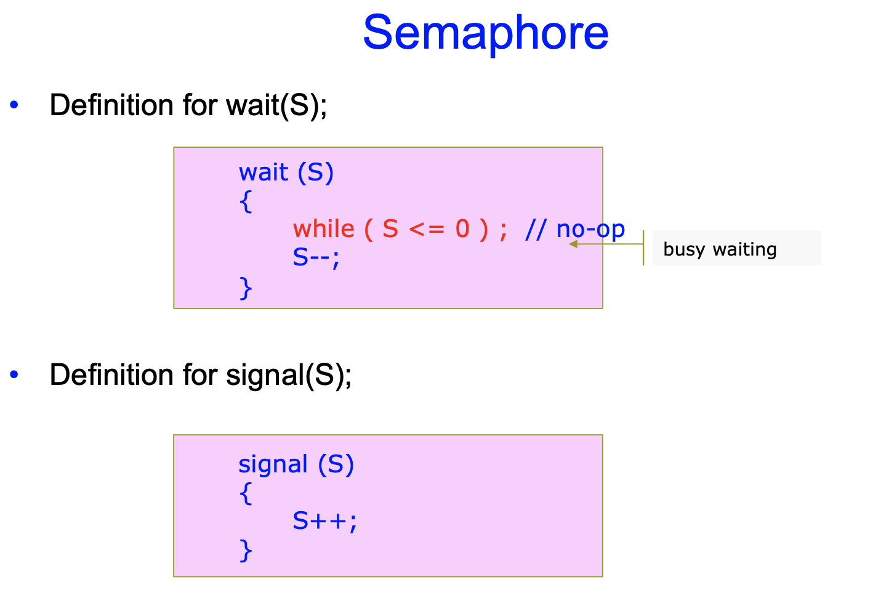

OS 정리 11
========

Chapter 6 - Process Synchronization
--------------

### Synchronization Hardware

* 추후에 정리한다.

---

### Semaphore

* 임계영역 문제를 다루는 여러 하드웨어 기반 해결책(TestAndSet(), Swap())이 있지만, 응용프로그래머가 사용하기에는 복잡하다.
* 이 어려움을 해결하기 위해 `Semaphore` 가 사용된다.
* 세마포어란,
  * __Busy Waiting__ 을 기다릴 필요가 없는 `Synchronization tool` 이다.
  * 세마포어 S는 __integer__ 변수이다.
  * 두 개의 표준 atomic 연산으로 접근이 가능하다 wait(), signal()
    * 원래 wait()는 검사하다를 의미하는 네덜란드어 Proberen에서 P라고, signal()은 증가하다를 의미하는 Verhogen에서 V라고 지어졌다.
  * wait()과 signal() 연산 시 세마포어의 정수값을 변경하는 연산은 반드시 __`atomic`__ 하게 실행되어야 한다.
  * 사용하기에 덜 복잡하다.

</img>

* S--; 연산과 S++; 연산은 __반드시 atomic__ 하다.

#### Usage of Semaphore

* `Counting semaphore`
  * integer 값이 제한없는 영역을 가진다. ex) 0, 1, ... ,10
* `Binary semaphore`
  * interger 값이 반드시 0 또는 1이다.
  * __mutex locks__ 라고도 불린다.
  * wait(mutex) : 임계영역에 들어가기 전에 mutex를 가져감으로써(0) 다른 프로그램들을 대기시키기
  * signal(mutex) : 임계영역에서 빠져나올 때 mutex를 되돌려놓음으로써(1) 다른 프로그램들을 진입할 수 있도록 만들기
* 이진 세마포어로 임계영역 문제를 해결하는 방법
  * n개의 프로세스가 세마포어, 즉 뮤텍스를 공유받는다.
  * 뮤텍스는 1로 초기화된다.
  * 예시 코드는 강의슬라이드 참조
    * 한 프로세스가 임계영역 이전의 진입구간(entry section)에서 wait(sem)을 실시. 이후 임계구간 진입
    * 그 동안 다른프로세스들은 기다린다. 이 때, busy waiting 대신 자기 봉쇄연산을 실행해 세마포어와 관련된 대기 큐에 넣어 스스로를 대기상태로 전환시킬 수 있다.
    * 임계구간을 빠져나오는 프로세스는 탈출구간(exit section)에서 signal(sem)을 실시.
    * 다른 프로세스들이 임계구간에 진입가능하게 됨. 이 때 봉쇄된 대기 큐의 프로세스들 중 하나를 CPU 스케줄러가 골라 실행시킨다.
  * 임계구간 해결책의 세가지 조건을 모두 만족하는가?
    * Bounded Waiting은 보장할 수 없다.
      * 일반적으로 wait()의 구현방식에 달렸다.
      * ex) Linux의 sem_wait()는 bounded waiting 조건을 만족하지 않는다.
* 카운팅 세마포어는 일반적으로 유한 개의 인스턴스로 이루어진 자원에 대한 접근을 제어한다.
  * 세마포어는 가용한 자원의 갯수로 __초기화__ 된다.
  * 리소스를 __사용__ 하기위해서, 프로세스는 wait() 연산을 수행한다.
  * 리소스를 __방출__ 하기 위해서, 프로세스는 signal() 연산을 수행한다.
  * 세마포어가 0이면, 모든 자원이 사용되고 있는 것이다.
* 카운팅 세마포어는 임계 영역에 여러개의 프로세스가 동시에 들어가야하는 경우를 고려해서 만들어졌다.
  * 예시) 병행 수행중인 프로세스 P1, P2가 있다고 치자.
  * P1은 S1을 수행하고, P2는 S2를 수행한다.
  * S2는 반드시 S1이 완료된 뒤에 수행되어야한다.
  * 세마포어를 사용하여 이 문제를 해결해보자.

</img>

* P1에서 S1 수행 후에 signal을 주어야지만 P2의 wait가 풀리고 S2를 실행할 수 있다.

#### Dining-Philosophers Problem

</img>

* 중앙에 __rice__ 가 있고, 5명의 철학자들은 __thinking__ 또는 __eating__ 만 할 수 있다.

* rice : 자원 / thinking : wait / eating : 자원 사용

* 젓가락은 한 짝씩만 있어서, 자기 옆의 1개씩 2개를 집어버리면 그 옆의 사람들은 먹을 수가 없다.

* 이 경우 어떻게 dealock과 starvation을 예방하여 먹을 수 있을까?

  * food에다 lock을 걸어버리면?
    * resource를 사용할 수 있는 사람은 최대 2사람인데, lock을 걸면 한명밖에 사용할 수 없게 된다.
  * 모두가 자기 오른쪽 젓가락을 한 짝씩만 들면?
    * deadlock에 걸려 아무도 resource를 사용할 수 없다.

* 이 문제는 __많은 부류의 병행제어(concurrency-control) 문제__ 중 하나이다.

* _교착상태와 기아를 발생시키지 않고 여러 스레드에게 여러 자원을 할당할 필요_를 단순하게 표현한 것이다.

* 해결법

  
</img>

  * chopstick[5]이라는 세마포어 배열을 만들어 1로 초기화한다.
  * 왼쪽 젓가락(chopstick[i])이 비기를 기다렸다가 집어들고, 오른쪽 젓가락(chopstick[(i+1)%5])이 비기를 기다렸다가 집어들고, 젓가락 쌍을 얻었으니 밥을 먹은 뒤 다시 한개씩 내려놓는다(signal)

